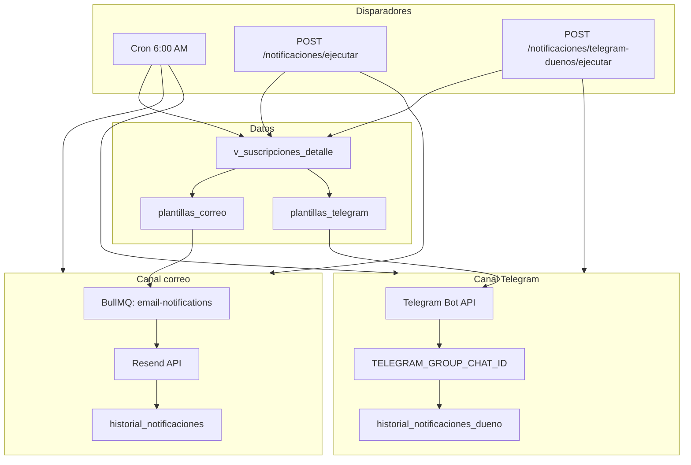
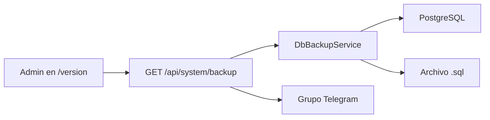

# Flujos del sistema — Control Servicios

Documentación de los procesos automáticos y manuales. Usa esta guía como plantilla al **agregar un flujo nuevo**: describe disparador, condiciones, plantilla, destino, permisos, historial y endpoints.

---

## Índice

1. [Visión general](#visión-general)
2. [Estados de suscripción (motor común)](#estados-de-suscripción-motor-común)
3. [Job diario 6:00 AM (cron)](#job-diario-600-am-cron)
4. [Flujo: correo a clientes](#flujo-correo-a-clientes)
5. [Flujo: Telegram al grupo (dueños)](#flujo-telegram-al-grupo-dueños)
6. [Catálogo de plantillas](#catálogo-de-plantillas)
7. [Flujo: registro de pago](#flujo-registro-de-pago)
8. [Flujo: login y 2FA](#flujo-login-y-2fa-resumen)
9. [Flujo: backup de base de datos](#flujo-backup-de-base-de-datos)
10. [Cómo agregar un flujo nuevo](#cómo-agregar-un-flujo-nuevo)

---

## Visión general



| Componente | Archivo principal |
|------------|-------------------|
| Cron diario | `backend/src/notificaciones/notifications-cron.service.ts` |
| Lógica correo | `backend/src/notificaciones/notificaciones.service.ts` |
| Worker cola | `backend/src/notificaciones/email.processor.ts` |
| Telegram dueños | `backend/src/notificaciones/telegram-dueno-notifier.service.ts` |
| Plantillas correo | `backend/src/plantillas/plantillas.service.ts` |
| Plantillas Telegram | `backend/src/plantillas-telegram/plantillas-telegram.service.ts` |
| Vista SQL estados | `backend/prisma/sql/views.sql` → `v_suscripciones_detalle` |

---

## Estados de suscripción (motor común)

Todos los flujos de notificación leen el **mismo estado dinámico** desde la vista `v_suscripciones_detalle`. No hay `CASE WHEN` en código TypeScript: las reglas viven en `estados_reglas`.

### Cálculo (por suscripción activa)

| Campo calculado | Significado |
|-----------------|-------------|
| `dias_vencido` | `CURRENT_DATE - fecha_corte` |
| `fecha_limite_gracia` | `fecha_corte + (aplica_gracia × dias_gracia)` |
| `dias_gracia_restantes` | Días hasta fin de gracia |

### Estados (`estados` + `estados_reglas`)

| Código | Nombre | Cuándo aplica (resumen) | Notifica |
|--------|--------|-------------------------|----------|
| `DISPONIBLE` | Al día | `dias_vencido < 0` | No |
| `VENCE_HOY` | Vence hoy | `dias_vencido = 0` | **Sí** (correo + Telegram) |
| `EN_GRACIA` | Días de gracia | Vencido, gracia activa, aún dentro del margen | **Sí** |
| `VENCIDA` | Vencida / cortada | Vencido y fuera de gracia (o sin gracia) | **Sí** |

La regla ganadora es la de **menor `prioridad`** que cumple rangos en `estados_reglas`.

### Filtros adicionales por canal

| Canal | Condiciones extra |
|-------|-------------------|
| **Correo** | `activo = true`, estado ∈ `{VENCE_HOY, EN_GRACIA, VENCIDA}`, `desea_notificaciones_correo = true`, email válido |
| **Telegram** | Mismo estado, operador con `alertasDuenoTelegramActivo = true`, `User.name = dueno_cuenta`, grupo en `.env` |

---

## Job diario 6:00 AM (cron)

**Clase:** `NotificationsCronService`  
**Expresión:** `CronExpression.EVERY_DAY_AT_6AM` (NestJS Schedule)

### Secuencia

1. Log: `Iniciando job diario de notificaciones`
2. **Correos:** `enqueueNotifications()` → encola un job por suscripción pendiente
3. **Telegram:** `telegramDueno.enviarAlertasDuenos()` → un mensaje por dueño al grupo

### Cola de correos (BullMQ + Redis)

| Paso | Comportamiento |
|------|----------------|
| Normal | Job `send-email` en cola `email-notifications` (3 reintentos, backoff exponencial 5 s) |
| Redis caído | Fallback **síncrono**: envía en línea sin cola (`processEmailJob`) |
| Timeout Redis | 5 s → mismo fallback |

**Requisitos:** `REDIS_HOST`, `REDIS_PORT` (Docker: `docker compose up -d redis`).

### Ejecución manual (misma lógica, sin esperar cron)

| Acción UI | Endpoint | Permiso |
|-----------|----------|---------|
| Correo a clientes | `POST /api/notificaciones/ejecutar` | `correos.enviar` |
| Telegram a dueños | `POST /api/notificaciones/telegram-duenos/ejecutar` | `correos.enviar` |

Consultas previas:

- `GET /api/notificaciones/pendientes` — clientes que recibirían correo
- `GET /api/notificaciones/telegram-duenos/pendientes` — dueños con alertas activas y clientes pendientes

---

## Flujo: correo a clientes

### Disparador

- Cron 6:00 AM **o** botón **Notificaciones → Correo a clientes**

### Pasos detallados

```
1. Cargar plantilla AVISO_PAGO_SUSCRIPCION (plantillas_correo)
   └─ Si activo = false → enqueued: 0, fin

2. SELECT * FROM v_suscripciones_detalle
   WHERE activo AND estado IN (VENCE_HOY, EN_GRACIA, VENCIDA)
     AND desea_notificaciones_correo = true

3. Filtrar emails válidos (regex básico)

4. Por cada suscripción:
   a. buildVariables() → objeto con 9 variables
   b. replaceVars(asunto) y replaceVars(cuerpoHtml)
   c. Encolar { suscripcionId, email, asunto, html }

5. Worker EmailProcessor.process()
   a. MailService.send() → Resend API
   b. INSERT historial_notificaciones (estado_envio, respuesta_resend)
```

### Plantilla usada

| Campo | Valor |
|-------|-------|
| **Código** | `AVISO_PAGO_SUSCRIPCION` |
| **Tabla** | `plantillas_correo` |
| **Editor UI** | `/plantillas` |
| **Permiso edición** | `plantillas.editar` |

### Variables `{{...}}` disponibles

| Variable | Origen |
|----------|--------|
| `cliente_nombre` | `cliente.nombre` |
| `plataforma` | plataforma de la cuenta |
| `perfil_nombre` | suscripción |
| `precio_cobro` | suscripción |
| `fecha_corte` | suscripción (ISO date) |
| `dias_gracia` | suscripción |
| `fecha_limite_gracia` | vista calculada |
| `estado_nombre` | estado dinámico |
| `color_hex` | badge del estado |

### Configuración `.env`

```env
RESEND_API_KEY="re_..."
MAIL_FROM_ADDRESS="Control Servicios <onboarding@resend.dev>"  # pruebas
# MAIL_FROM_ADDRESS="Notificaciones <notificaciones@tudominio.com>"  # producción
```

Si `RESEND_API_KEY` no está configurado → envío **simulado** (log, sin API).

### Auditoría

Tabla **`historial_notificaciones`**: `suscripcion_id`, `email`, `estado_envio` (`enviado` | `error`), `respuesta_resend` (JSON), `created_at`.

---

## Flujo: Telegram al grupo (dueños)

### Disparador

- Cron 6:00 AM (después de encolar correos) **o** **Notificaciones → Telegram a dueños**
- Prueba: **Seguridad → Enviar mensaje de prueba al grupo** (`POST /api/auth/telegram/test-group`)

### Configuración (solo `.env`, sin Chat ID en BD)

```env
TELEGRAM_BOT_TOKEN="..."
TELEGRAM_GROUP_CHAT_ID="-5442163471"
```

El bot debe estar **en el grupo** con permiso de enviar mensajes.

### Pasos detallados

```
1. Si TELEGRAM_GROUP_CHAT_ID vacío → omitir (log warn)

2. SELECT suscripciones en estados críticos (misma vista que correo)

3. Agrupar por dueno_cuenta (nombre del titular de la cuenta)

4. SELECT users WHERE alertasDuenoTelegramActivo = true AND status = active

5. Por cada operador con suscripciones en su grupo (user.name = dueno_cuenta):
   a. buildMessage(duenoNombre, subs):
      - TELEGRAM_ALERTAS_HEADER  → {{dueno_nombre}}
      - Secciones armadas en código (Vence hoy / Gracia / Vencidas)
      - TELEGRAM_ALERTAS_FOOTER
   b. TelegramService.sendMessage(groupChatId, texto)  [parse_mode: HTML]
   c. INSERT historial_notificaciones_dueno
```

### Plantillas usadas

| Código | Uso | Variables |
|--------|-----|-----------|
| `TELEGRAM_ALERTAS_HEADER` | Encabezado del resumen diario | `dueno_nombre` |
| `TELEGRAM_ALERTAS_FOOTER` | Pie del mensaje | — |
| `TELEGRAM_ALERTAS_SETUP` | Al activar alertas en Seguridad | `usuario` |
| `TELEGRAM_TEST_GRUPO` | Mensaje de prueba | `usuario` |
| `TELEGRAM_2FA_CODE` | Código login 2FA (al grupo) | `code`, `usuario` |

Editor: **`/plantillas-telegram`** · Tabla: `plantillas_telegram`

Las **listas de clientes** dentro del resumen se generan en código (`telegram-dueno-notifier.service.ts` → `buildMessage`), no son plantilla editable línea a línea.

### Opt-in por operador

En **Seguridad → Activar mis alertas en el grupo** se pone `users.alertasDuenoTelegramActivo = true`.  
El **`User.name`** debe coincidir con **`cuentas_plataforma.dueno_nombre`** (ej. Guillermo).

### Auditoría

Tabla **`historial_notificaciones_dueno`**: `user_id`, `dueno_nombre`, `telefono`, `telegram_chat_id` (Id del grupo), `suscripciones_count`, `estado_envio`, `mensaje_resumen`.

---

## Catálogo de plantillas

### Correo (`plantillas_correo`)

| Código | Asunto / cuerpo | Disparado por |
|--------|-----------------|---------------|
| `AVISO_PAGO_SUSCRIPCION` | HTML recordatorio de pago | Cron, manual correo |

### Telegram (`plantillas_telegram`)

| Código | Disparado por |
|--------|---------------|
| `TELEGRAM_ALERTAS_HEADER` | Cron / manual Telegram dueños |
| `TELEGRAM_ALERTAS_FOOTER` | Idem |
| `TELEGRAM_ALERTAS_SETUP` | Activar alertas (Seguridad) |
| `TELEGRAM_TEST` | Legacy / fallback |
| `TELEGRAM_TEST_GRUPO` | Prueba al grupo |
| `TELEGRAM_2FA_CODE` | Login con 2FA Telegram |

Sustitución: `{{variable}}` → `replaceVars` / `replaceTemplateVars`.

---

## Flujo: registro de pago

**No envía notificaciones**; actualiza `fecha_corte` para sacar al cliente de estados críticos en el próximo cálculo.

| Paso | Detalle |
|------|---------|
| Disparador | UI Suscripciones → **+1 mes** o modal **Registrar pago** |
| Endpoint | `POST /api/suscripciones/:id/registrar-pago` `{ "meses": 1-24 }` |
| Permiso | `suscripciones.editar` |
| Lógica | `addMonthsKeepCutDay(fecha_corte, meses)` — conserva día del mes |
| Efecto | Al día siguiente el cron puede dejar de incluir esa suscripción si pasa a `DISPONIBLE` |

Archivos: `backend/src/common/utils/fecha-corte.util.ts`, `suscripciones.service.ts`.

---

## Flujo: login y 2FA (resumen)

Detalle de seguridad en [SECURITY.md](./SECURITY.md).

```
POST /auth/login
  → credenciales OK
  → si 2FA activo:
       tempToken + envío TELEGRAM_2FA_CODE al grupo (si telegramEnabled)
       o código TOTP en app
  → POST /auth/2fa/verify { tempToken, code }
  → JWT access_token
```

Alternativa: **QR entre dispositivos** (`/auth/qr/session/*`).

---

## Flujo: backup de base de datos

Respaldo lógico SQL (esquema + datos). Detalle de seguridad en [SECURITY.md](./SECURITY.md#backup-de-base-de-datos).



| Aspecto | Detalle |
|---------|---------|
| **Disparador** | Manual — botón en `/version` o CLI |
| **Permiso** | `usuarios.gestionar` (solo administradores) |
| **Endpoint** | `GET /api/system/backup` |
| **Respuesta** | `application/sql` con `Content-Disposition: attachment` |
| **Contenido** | Enums, tablas, índices, vistas, INSERT por tabla |
| **Notificación** | Plantilla `TELEGRAM_BACKUP_BD` al `TELEGRAM_GROUP_CHAT_ID` |
| **Variables plantilla** | `usuario`, `email`, `fecha`, `archivo`, `tamano` |
| **CLI** | `npm run db:backup` → `backups/<db>_<timestamp>.sql` (sin Telegram) |

Archivos: `backend/src/system/db-backup.service.ts`, `system.service.ts`, `system.controller.ts`, `scripts/db-backup.cjs`.

---

## Cómo agregar un flujo nuevo

Plantilla para documentar e implementar:

### 1. Definir el flujo

| Pregunta | Ejemplo |
|----------|---------|
| **Nombre** | Recordatorio WhatsApp |
| **Disparador** | Cron / manual / evento API |
| **Condición** | Misma vista + filtros extra |
| **Destinatario** | Cliente / dueño / grupo |
| **Plantilla** | Nueva fila en `plantillas_*` o mensaje fijo |
| **Permiso manual** | `correos.enviar` |
| **Historial** | Nueva tabla o reutilizar existente |

### 2. Implementación backend (checklist)

- [ ] Servicio con método `ejecutarX()` / `enqueueX()`
- [ ] Registrar en cron si es automático (`notifications-cron.service.ts`)
- [ ] Endpoint `POST /api/notificaciones/...` con `@Permissions(...)`
- [ ] Seed de plantilla si aplica
- [ ] Entrada en este documento (sección + diagrama)

### 3. Implementación frontend

- [ ] Botón en vista correspondiente (ej. Notificaciones)
- [ ] Toast / manejo de errores
- [ ] Listado de pendientes (opcional)

### 4. Variables de entorno

Documentar en `.env.example` y [SECURITY.md](./SECURITY.md) si introduce secretos o destinos externos.

---

## Referencia rápida de endpoints de notificaciones

| Método | Ruta | Descripción |
|--------|------|-------------|
| GET | `/api/notificaciones/pendientes` | Clientes pendientes de correo |
| POST | `/api/notificaciones/ejecutar` | Encolar/enviar correos |
| GET | `/api/notificaciones/historial` | Historial correos |
| GET | `/api/notificaciones/telegram-duenos/pendientes` | Dueños con alertas + conteos |
| POST | `/api/notificaciones/telegram-duenos/ejecutar` | Enviar resúmenes al grupo |
| GET | `/api/notificaciones/telegram-duenos/historial` | Historial Telegram |
| POST | `/api/auth/telegram/test-group` | Prueba al grupo |
| GET | `/api/plantillas` | Plantillas correo |
| GET | `/api/plantillas-telegram` | Plantillas Telegram |
| GET | `/api/system/backup` | Descarga backup BD (admin) |
